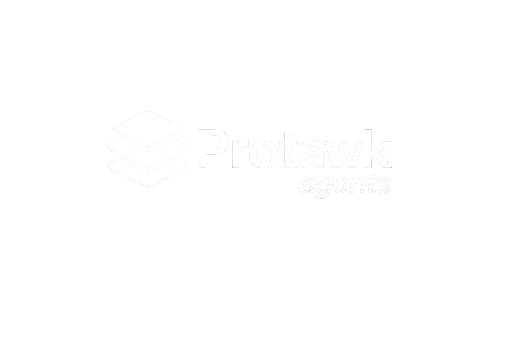

<div align="center">
  

  **Reusable TypeScript agent infrastructure for multi-tenant applications.**

  [](https://github.com/protawk-com/agents)
  [](https://www.typescriptlang.org/)
  [](https://nodejs.org/)
  [](LICENSE)
</div>

<br />

This package provides a generic agent loop, tool registry, and provider helper. Product-specific tools, prompts, and authorization stay in the consuming app.

## ✨ Features

- **Generic Agent Loop:** Standardized loop for building robust agent workflows.
- **Tool Registry:** Easily register, manage, and distribute tools for your agents.
- **Provider Helpers:** Built-in helpers for AI SDK providers (e.g., OpenRouter).
- **TypeScript First:** Fully typed for safe, scalable, and rapid development.

## 🚀 Setup

Install the dependencies and build the package:

```bash
yarn install
yarn build
```

## 💻 Local Development

Run the TypeScript compiler in watch mode:

```bash
yarn dev
```

## 📦 Build And Package

To perform typechecking, create a clean build, and package the artifact:

```bash
yarn typecheck
yarn build
yarn pack:artifact
```

> **Note:** `yarn pack:artifact` creates `protawk-agents.tgz`. The package lifecycle runs a clean build before packing, so the artifact is always created from the current source.

## 🛠️ Usage

Import the necessary functions from the package to start building your agent infrastructure:

```ts
import {
  createToolRegistry,
  runAgent,
} from "@protawk/agents";

// Add your specific implementation here...
```
